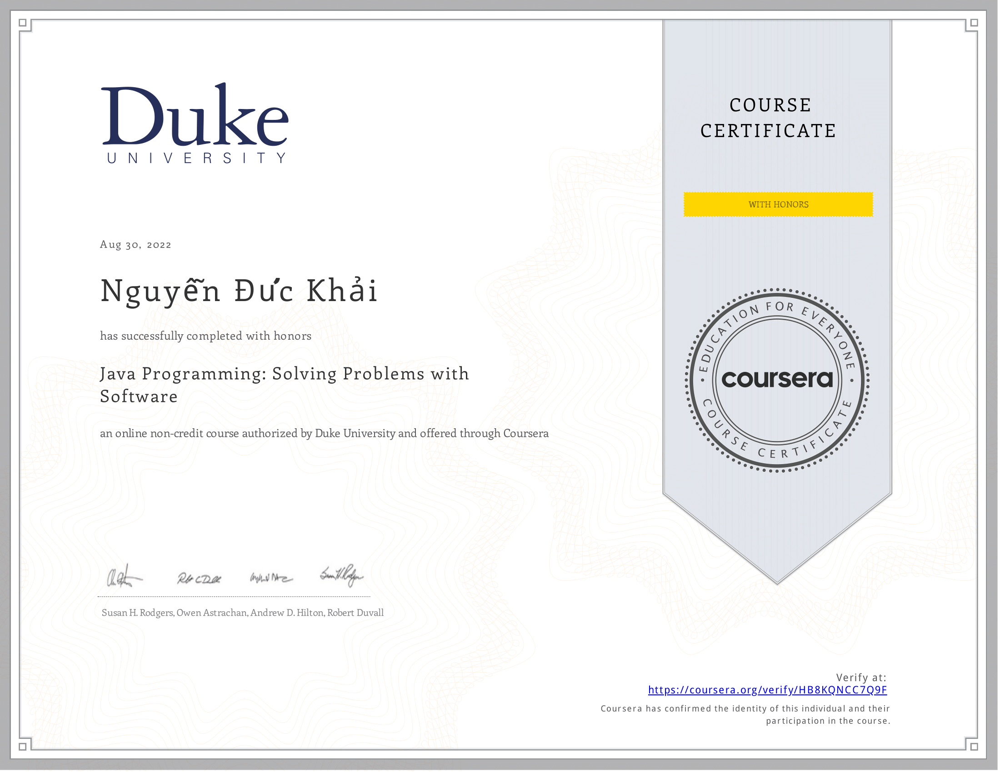

<h1 align="center">Hi 👋, My name is Duc Khai</h1>
<h3 align="center">A passionate developer from Vietnam</h3>

  

- 🌱 I’m currently learning **spring framework, spring boot**

- 🤝 I’m looking for help with **partime java internship**

- 👨‍💻 All of my projects are available at [https://github.com/KhaiNguyenDuc](https://github.com/KhaiNguyenDuc)

- 📫 How to reach me **duckhailinux@gmail.com**

 
 
<h1 align="left">Connect with me:</h1>

 
<h1 align="left">Skills:</h1>

          

 
<h1 align="left">Stats:</h1>

&nbsp;

 
<h1 align="left">Certificates:</h1>

  

